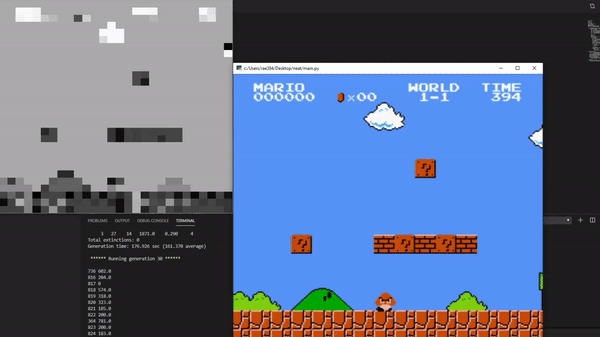

# PyMarI-O
Inspired by SethBling's "MarI/O - Machine Learning for Video Games" video, I implemented the NEAT algorithm on Python using OpenAI Gym Retro and NEAT-python libraries. It tries to tackle the 1st level of the original Super Mario Bros.



Instructions to run 

```
pip install -r requirements.txt
python -m retro.import rom/SuperMarioBros-Nes.nes
python main.py 
```
